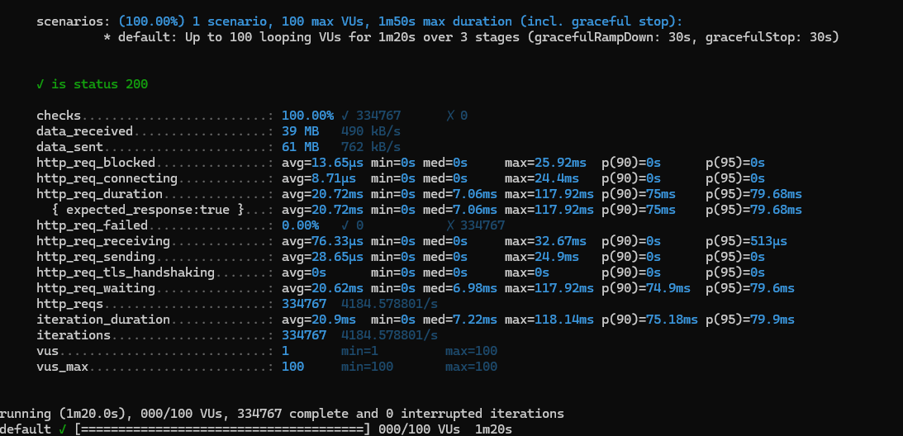

<h1 align="center" id="title">Spring boot Kafka</h1>

## Table of Contents

* [About The Project](#about-the-project)
* [Prerequisites](#prerequisites)
* [Installation](#installation)
* [Load Testing](#load-testing)

### About The Project

This project demonstrates how to use Spring Kafka to produce and consume messages to and from Kafka topics. It covers basic concepts such as setting up Kafka producers and consumers, configuring topics, and handling message processing.

### Prerequisites

* Docker
* Java 21
* k6 (Optional)

### Installation

1. Run Docker

2. Execute following command<br>

```sh
  docker-compose up -d --build
```

### Load Testing

1. Run k6 command.

load test place order via api
```sh
  k6 run api.js
```


load test place order via kafka
```sh
  k6 run kafka.js
```

